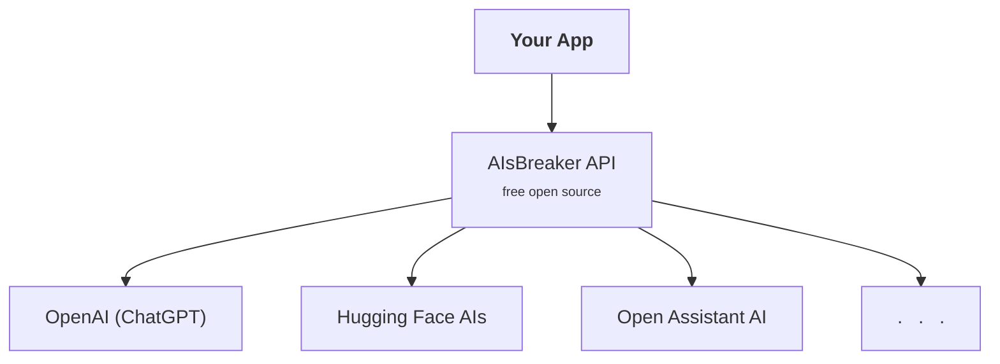
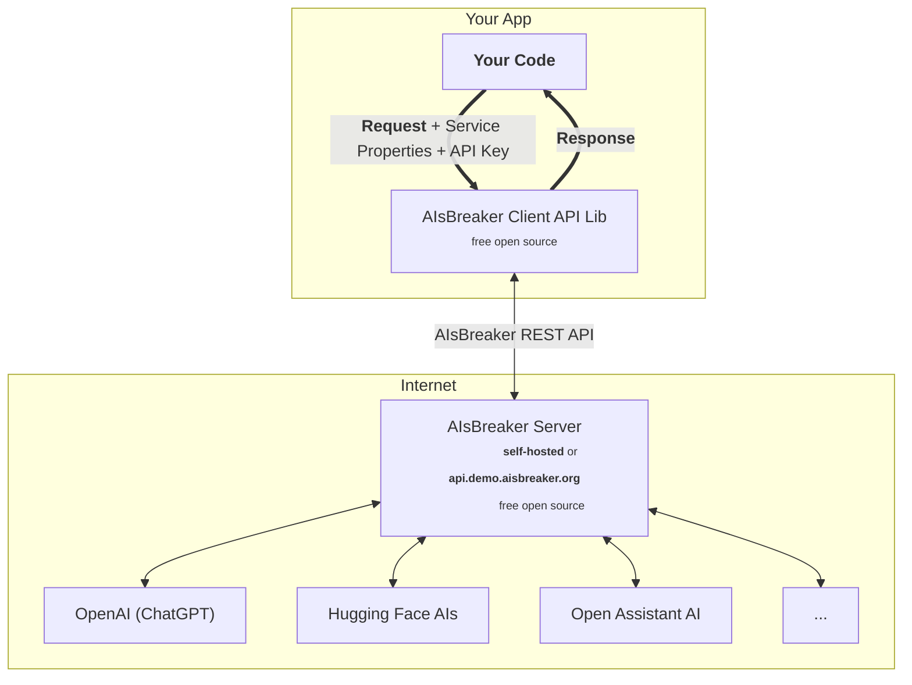
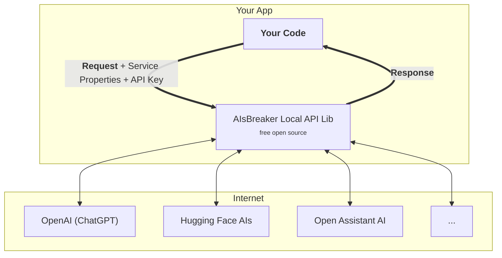

Architecture
============

Overview
--------
When you implement your own app using any AIsBreaker API, you can access any third-party AI service all through a consistent and standardized interface.

AIsBreaker Client API Architecture
----------------------------------
When you implement your own app, you will usually use this API, implemented by the respective library. Here, the third-party AI services are called indirectly - via the intermediate AIsBreaker server.

The AIsBreaker Client API library is currently available for TypeScript/JavaScript, but implementations for Python and Java/Kotlin/JVM are planned.

Read more:
- [Basic Concepts](./concepts) of service properties, API keys, requests and responses
- [AIsBreaker Client API](./aisbreaker-client-api) details

Instead of using the library, you can also call the REST API of the AIsBreaker server directly, but this is less convenient and not recommended.

AIsBreaker Local API Architecture
---------------------------------
::: tip
<!--**Beginners** should skip this section and continue with [Basic Concepts](./concepts). -->
The following provides a more details. If you just want to use the API you can safely skip it and continue with [Basic Concepts](./concepts).
:::

An AIsBreaker Local API library is also available, but only recommend for the internal AIsBreaker Server implementation itself and **not recommended for general use**.

With the AIsBreaker Local API, the 3rd-party AI services are called directly from within your app. This can cause additional problems, e.g. in dandling the API keys correctly and should only be used if really needed. 

The AIsBreaker Local API library is only available for TypeScript/JavaScript.

