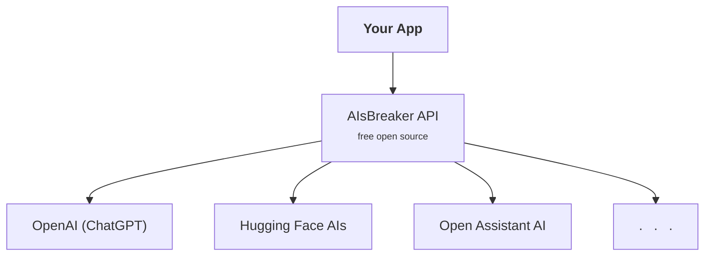

<!--AIsBreaker Docs-->
AIsBreaker API Docs
===================

Our Vision
----------
We want to provide a free and open-sourced tool for app developers to access almost any generative AI service in the most easy and most open way.

<!--What is AIsBreaker?-->
What is AIsBreaker API?
-----------------------
AIsBreaker offers a developer-friendly API for streamlined access to a variety of AI services, including the OpenAI/ChatGPT API, Hugging Face AIs, Open Assistant API, and more, all through a consistent and standardized interface. It is a free open-source tool designed to prevent vendor lock-in, ensuring users have the freedom to choose and switch between different service providers without constraints.

APIs/SDKs are available for JavaScript/TypeScript, Java/Kotlin/JVM, Python (under development), Bash Shellscript, and REST API.

Free open-source with MIT license.

How to Read the Docs?
---------------------
You can explore AIsBreaker in these phases:
- checkout our demos: [JavaScript Code (Intro)](./demo-javascript-intro), [REST API Access (Intro)](./demo-rest-api-access-intro), [Chat WebApp (Intro)](./demo-chat-webapp-intro)
- read the [Architecture (Overview)](./architecture)
- read about the [Basic Concepts](./concepts)
- follow the **Getting Started** tutorial in your preferred programming language:
  - [TypeScript/JavaScript](./getting-started-with-typescript-javascript)
  - [Java/Kotlin/JVM](./getting-started-with-java)
  - [Python](./getting-started-with-python)
  - [Bash Shellscript](./getting-started-with-bash)
  - and [Others ...](./aisbreaker-rest-api)
- explore more details
