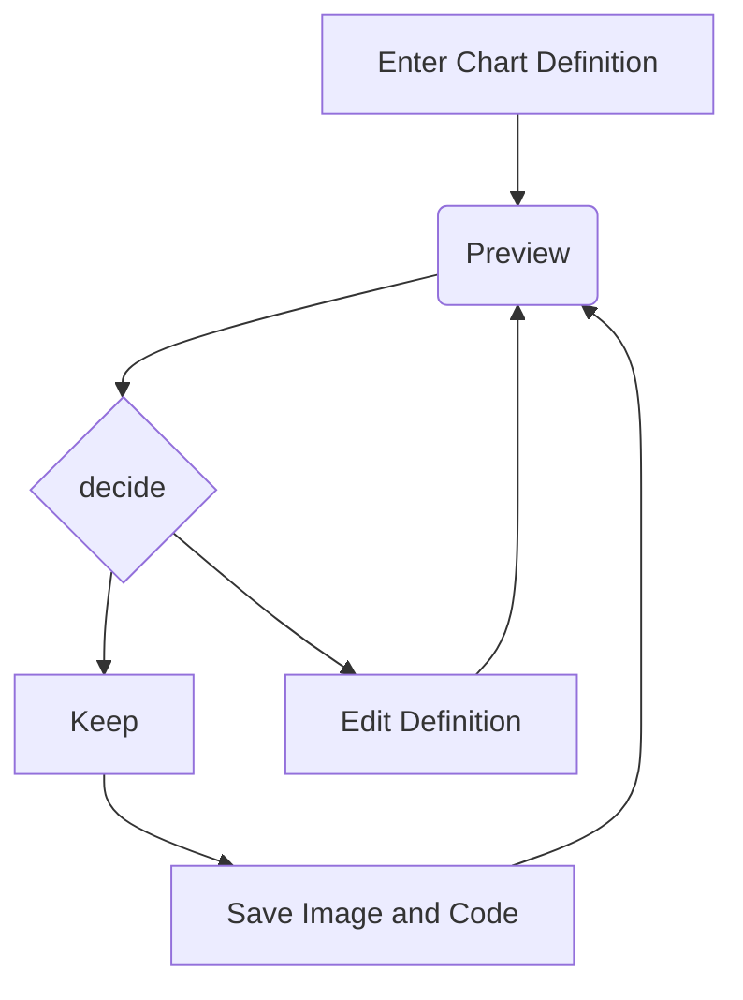

# Writing Docs for AIsBreaker.org


## Introduction
The docs includes the full documentation, from an introduction of the AIsBreaker project to in-depth technical docs and references.

We use [VitePress](https://vitepress.dev/) to generate the static website.

If you want to contribute, please checkout the [Contact page](/contact) for more details.


## Changing the Docs
Source code (markdown files) of this docs: [github.com/aisbreaker/aisbreaker.org/](https://github.com/aisbreaker/aisbreaker.org/)

To locally run a web server to check the rendered results in real-time before committing:
```bash
cd aisbreaker.org/
./startVitepressDevserver.sh
```


## Formatting Hints
Markdown formatting hints:
- [markdown-examples.md](./markdown-examples.md)
  - Check out the documentation for the [full list of markdown extensions](https://vitepress.dev/guide/markdown).
    - [Import Code Snippets](https://vitepress.dev/guide/markdown#import-code-snippets)
    - [Code Groups](https://vitepress.dev/guide/markdown#code-groups)


## Examples
Some examples of static tech docs - maybe a source of inspiration:
- https://github.com/vuejs/vitepress/tree/main/docs/
- https://github.com/expressjs/expressjs.com/tree/gh-pages/en/


## Diagrams with Mermaid
We use [Mermaid](https://mermaid.js.org/intro/) to generate diagrams. It is a diagramming and charting tool that uses Markdown-inspired text definitions and a renderer to create and modify complex diagrams.

It's integrated into VitePress with the [vitepress-plugin-mermaid](https://github.com/emersonbottero/vitepress-plugin-mermaid).

Example:

    ```mermaid
    graph TD
      A[Enter Chart Definition] --> B(Preview)
      B --> C{decide}
      C --> D[Keep]
      C --> E[Edit Definition]
      E --> B
      D --> F[Save Image and Code]
      F --> B
    ```

Example result:




