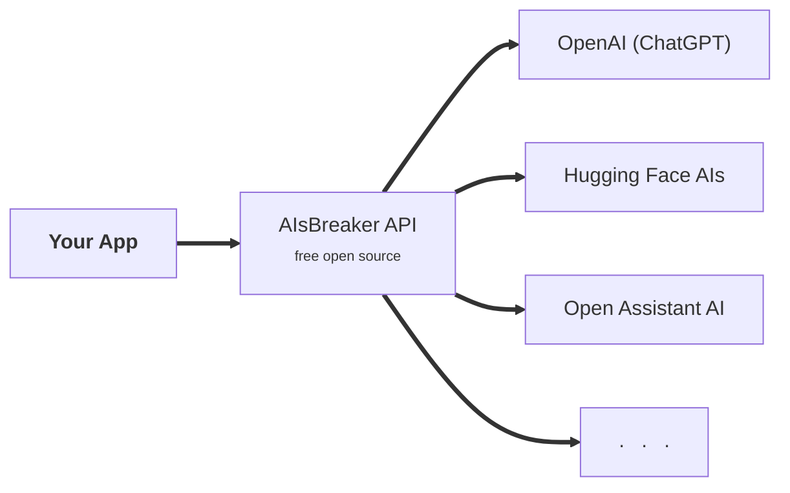

Docs-internal Page for Image Generation
=======================================

Architecture Overview for Home Page
-----------------------------------

Screenshot with withe background/theme. Post-processing im GIMP to remove background.
